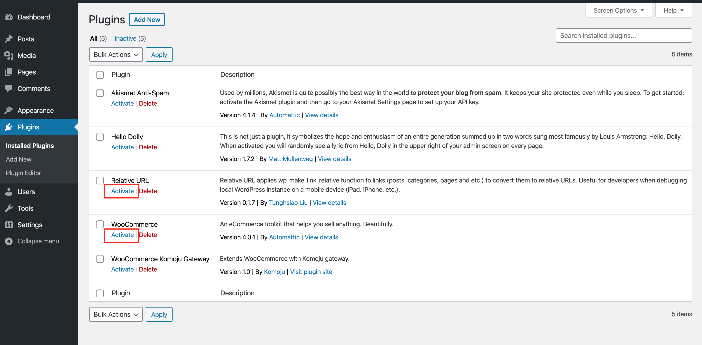
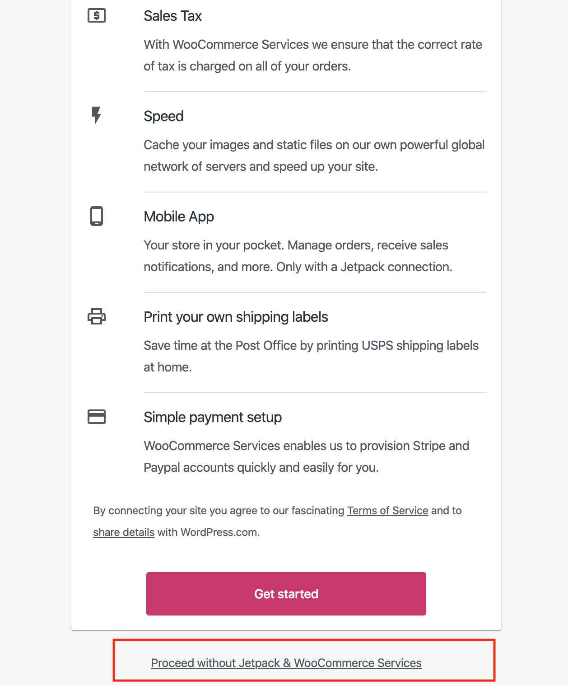
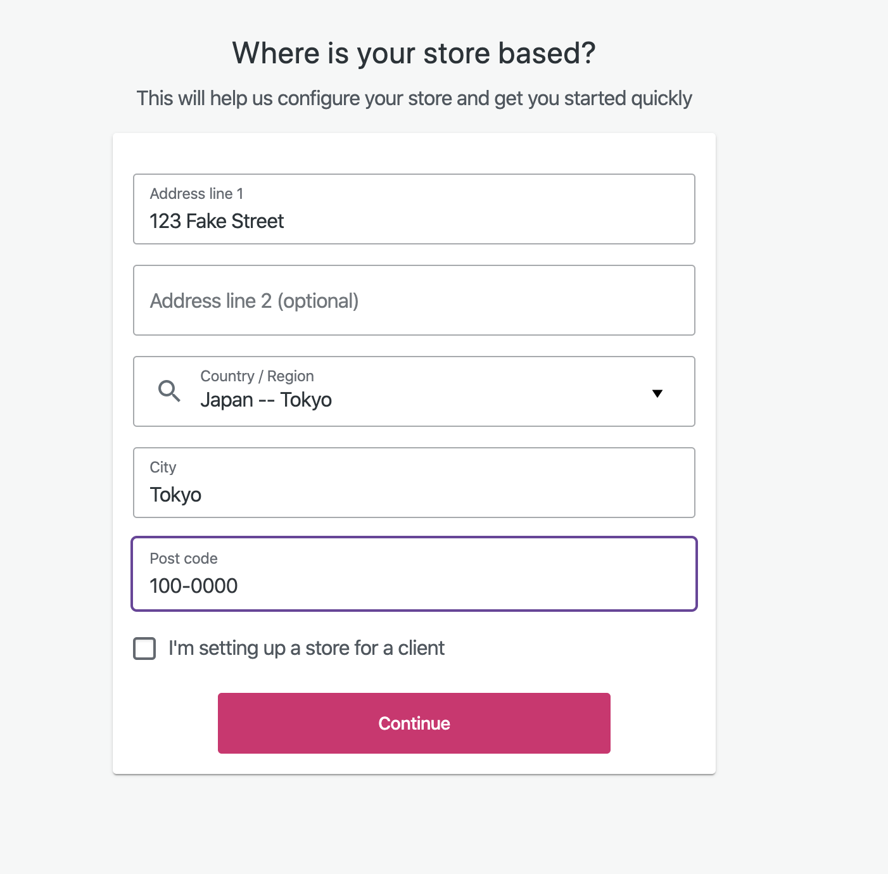
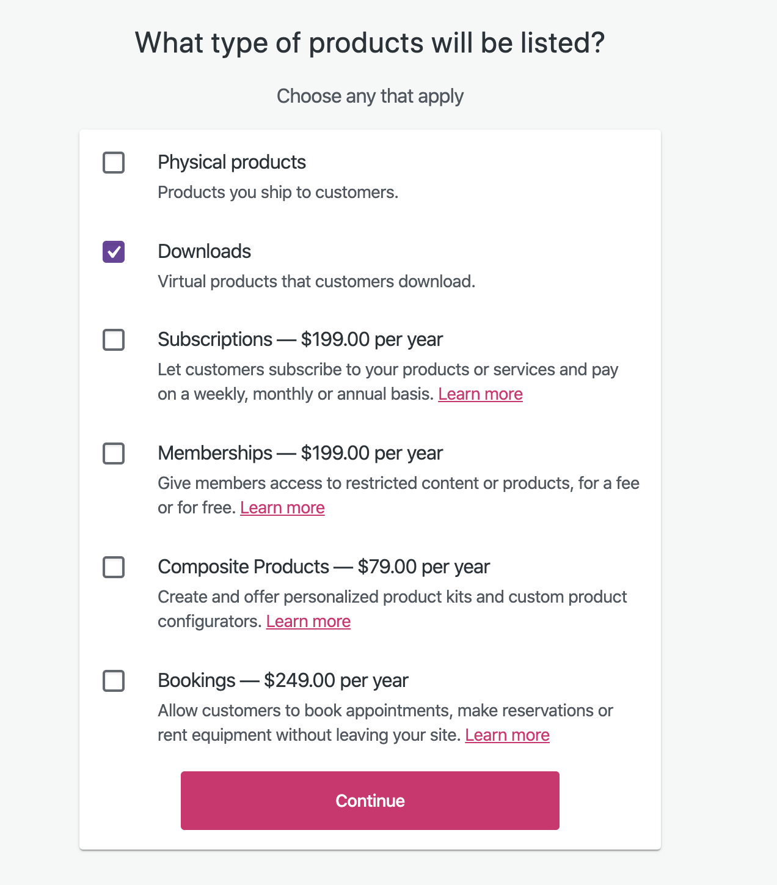
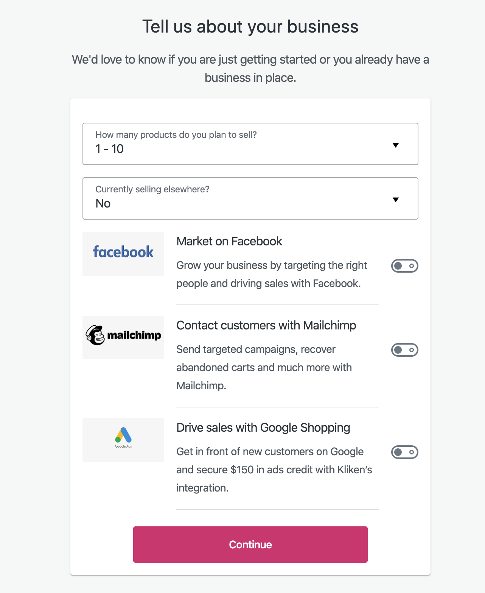
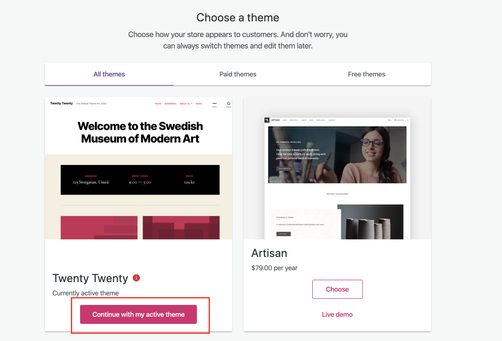
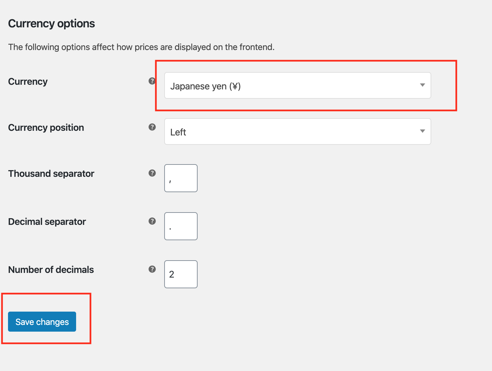
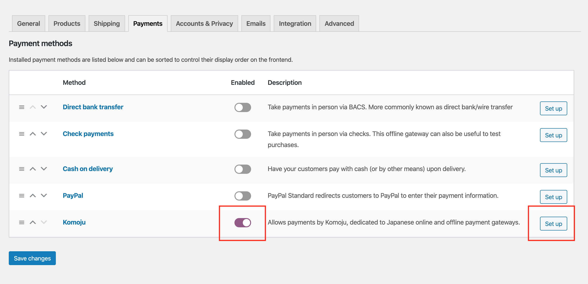
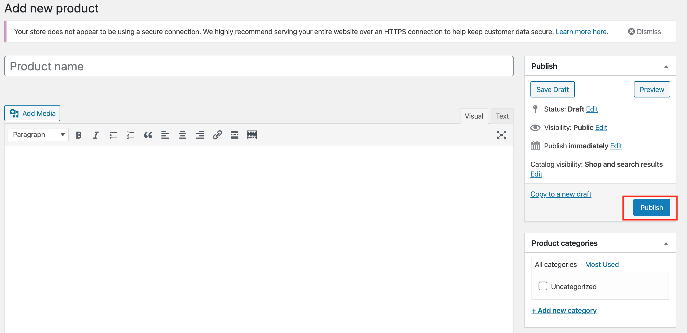

# 開発環境セットアップ (Dev Setup)

このドキュメントは、WordPressとWooCommerceを使った開発環境の詳細なセットアップ手順を提供します。記載している手順は、WordPressバージョン 9.5.2 および WooCommerceバージョン 6.7.1 で動作確認を行ったものです。

---

## 1. GitHubリポジトリのクローン

まず、KOMOJU WooCommerce プラグインのリポジトリをクローンします:

```sh
git clone https://github.com/degica/komoju-woocommerce
cd komoju-woocommerce
```

## 2. WordPress 環境の準備

WooCommerce プラグインを実行するには、WordPress インスタンスが必要です。Docker を使用してセットアップできます。

```sh
docker-compose up
```

このコマンドにより、Docker イメージと WordPress プラグインがダウンロードされます。初期セットアップが完了し (Docker のログが継続的に流れなくなった状態)、`127.0.0.1:8000` にアクセスすると WordPress のセットアップ画面が表示されます。

## Ngrok の設定

KOMOJU-WooCommerceプラグインは、決済完了後の通知を受け取るために Webhookを使用します。そのため、ローカルの WordPress インスタンスをインターネットからアクセス可能にする必要があります。[ngrok](https://ngrok.com/) を使用してこれを実現できます。

```sh
ngrok http -host-header=rewrite http://127.0.0.1:8000
```

**注意:** ngrok のエンドポイントからウェブサイトにアクセスすると、一部の機能が正常に動作しない可能性があります。通常のチェックアウトフローは `127.0.0.1` を使用し、Webhook の統合のみ ngrok を利用してください。

## WordPressのセットアップ

WordPressのセットアップ画面に移ったら、ユーザー名やパスワードなどを任意で入力します（後で思い出せるようにしてください）。
画面左下にある「Install WordPress」をクリックするとインストールが完了します。

ログインを求められたら入力して、WordPress管理画面にアクセスできる状態になればOKです。

# WooCommerceのセットアップ

1. 左サイドバーで「Plugins」をクリックします。  
2. 「Relative URL」という名前のプラグインの下にある「Activate」をクリックし、有効化します（ngrokとの連携を動かすために必要です）。  
3. 「WooCommerce」という行の「Activate」をクリックし、有効化します。これでWooCommerceのセットアップページが表示されます。  
   

4. 「Yes please」をクリックして、セットアップを開始します。  
5. 「Start setting up your WooCommerce store」というページで、最下部までスクロールし、「Proceed without Jetpack & WooCommerce Services」というリンクをクリックします（開発環境では必要ないため）。  
   

6. 「Build a Better WooCommerce」というポップアップが出たら、チェックボックスにチェックを入れず「Continue」をクリックします。  
7. 住所を求められたら、ダミーの情報を入力します。  
   

8. 「In which industry does the store operate?」というページでは、好みの業種を選択し、「Continue」をクリックします。  
9. 「What type of products will be listed?」では、Virtual または Physical を選択し、「Continue」をクリックします。  
   

10. 「Tell us about your business」というページでは、商品数を選択し、「Currently selling elsewhere?」を「No」にして、その下に表示されるオプションをすべて無効にした上で「Continue」をクリックします。  
    

11. 「Choose a theme」というページでは、「Continue with my active theme」をクリックします。  
    

12. WordPressの管理画面にリダイレクトされます。  
13. 左サイドパネルの「WooCommerce」→「Settings」をクリックします。  
14. 下へスクロールして「Currency Options」まで進みます。  
15. 「Currency」フィールドを「Japanese Yen (¥)」に設定します。  
16. ページ下部の「Save changes」をクリックします。  
    

---

# KOMOJU-WooCommerceプラグインの設定

1. WordPress管理画面で、左サイドパネルの「Plugins」をクリックします。  
2. 「WooCommerce Komoju Gateway」の下にある「Activate」をクリックし、有効化します。  
3. 左サイドパネルの「WooCommerce」→「Settings」をクリックします。  
4. メインコンテンツ上部のタブで「Payments」をクリックします。  
5. 「Komoju」の隣にある「Enabled」トグルをオンにしてKomojuを有効にし、「Set up」をクリックして設定画面へ進みます。  
   

6. テスト用のKomojuアカウントを使用してAPI設定を行います。  
   Webhookの設定をREADMEに従って正しく行っていることを確認してください。

---

# WooCommerceに商品の追加

決済テストを行うには、購入可能な商品が1つ以上必要です。

1. WordPress管理画面で、左サイドパネルの「Products」をクリックし、メイン画面にある「Create product」をクリックします。  
2. 任意の商品名を入力します。  
3. 商品の説明を入力します。  
4. 商品の価格を設定します。  
5. 「Publish」をクリックします。  
   

以上で設定が完了したら、  
[http://127.0.0.1:8000/?post_type=product](http://127.0.0.1:8000/?post_type=product)  
にアクセスするとショップ画面が表示され、Komoju連携のテストに利用できる商品が確認できます。